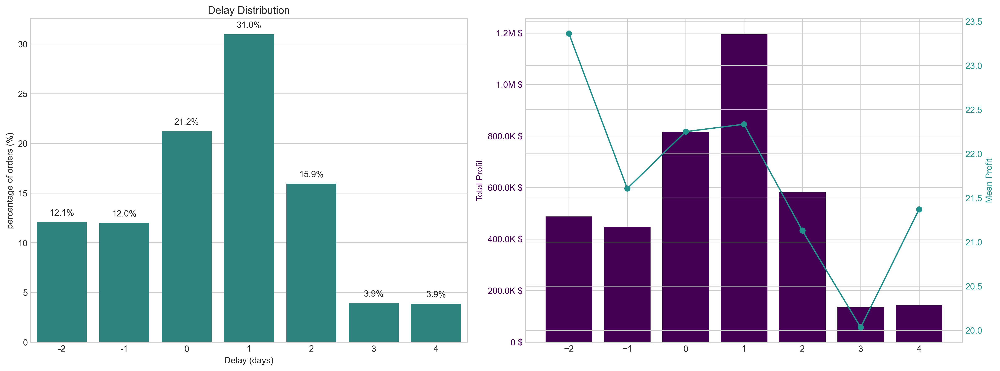
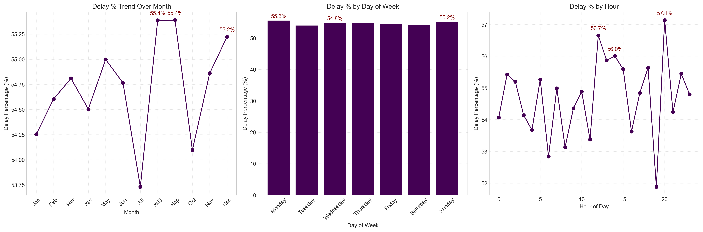
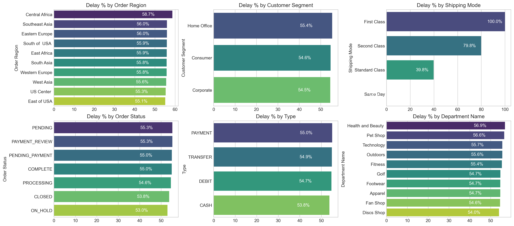
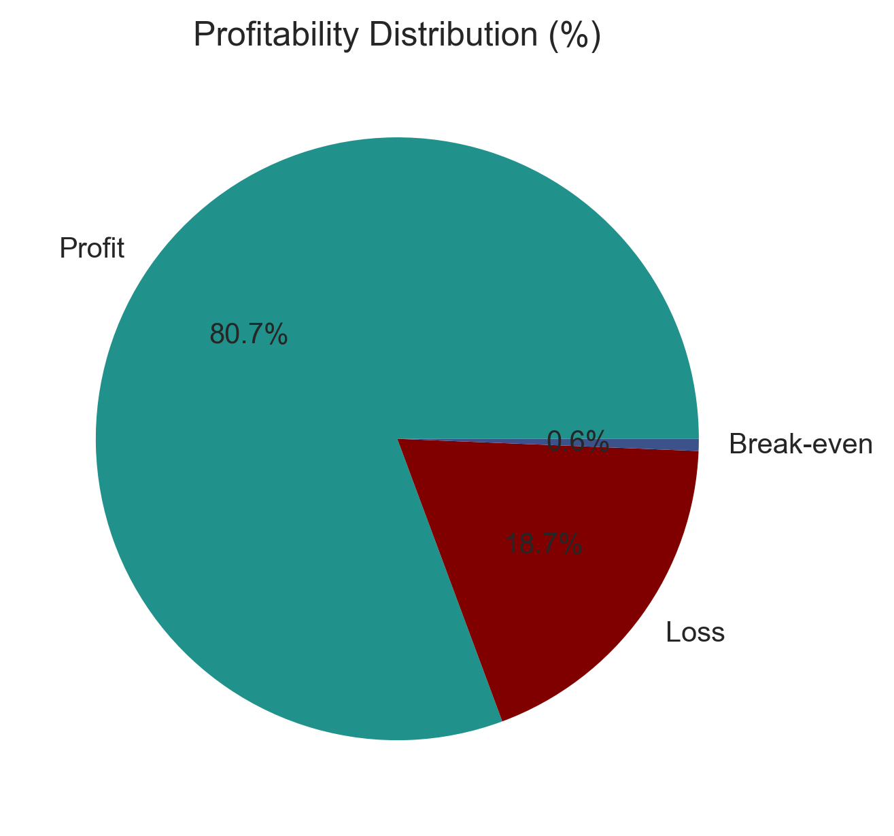
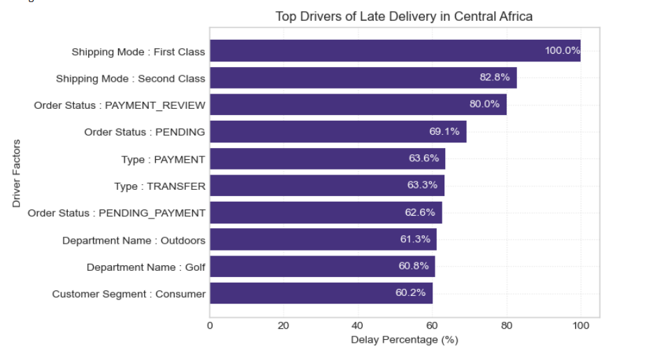

# Supply Chain Delivery Delay & Operational Risk Analysis

**End-to-end Supply Chain Analytics | Exploratory Data Analysis | Machine Learning**

An end-to-end supply chain analytics and machine learning project investigating delivery delays, identifying operational bottlenecks, analyzing profitability, and predicting potential fulfillment SLA breaches.

## Project Overview

Late deliveries can negatively affect customer satisfaction, supply chain efficiency, logistics costs, and profitability. This project analyzes order-level supply chain data to understand delivery performance, identify patterns associated with late deliveries, and explore how machine learning can support proactive operational risk management.

The analysis covers **172K+ orders** and investigates a reported **54.7% late-delivery rate**, with a focus on identifying potential drivers of delivery delays and improving fulfillment decisions.

## Business Objectives

* Measure overall delivery performance and late-delivery frequency.
* Identify product categories and operational segments associated with delivery delays.
* Explore delivery trends across time and other available business dimensions.
* Investigate relationships between delivery performance and profitability.
* Develop a machine learning pipeline to classify potential delivery SLA breaches.
* Translate analytical findings into actionable business recommendations.

## Key Areas of Analysis

### 1. Delivery Performance Analysis

* Analyze the distribution of late and on-time deliveries.
* Examine delivery delay patterns.
* Investigate trends across available time dimensions.

### 2. Operational Bottleneck Detection

* Explore delivery performance across product categories and other available operational segments.
* Identify areas that may require further investigation or process improvement.
* Analyze potential drivers of late delivery.

### 3. Profitability Analysis

* Examine profitability distributions.
* Investigate relationships between operational performance and profitability.
* Identify areas for deeper business analysis.

### 4. Machine Learning for Delivery Risk

The project explores a classification approach to predict potential fulfillment SLA breaches.

**Planned / implemented modeling techniques:**

* Random Forest classification
* SMOTE for handling class imbalance
* Feature engineering and data preprocessing
* Model evaluation using appropriate classification metrics

The final evaluation should report measured performance on a held-out test set rather than relying on training accuracy alone.

## Key Findings

* **Dataset scale:** More than 172,000 orders.
* **Reported late-delivery rate:** 54.7%.
* **Operational insights:** Visual analysis investigates delivery trends, category-level bottlenecks, and potential drivers of late delivery.
* **Profitability insights:** Visualizations examine profitability distribution and its relationship to supply chain operations.
* **Predictive analytics:** Machine learning is used to explore the prediction of potential delivery SLA breaches.

*Note: Validate all headline figures against the final analysis and dataset before presenting them as definitive results.*

## Visual Insights

### Delivery Delay Distribution and Profit Analysis



### Delivery Trends by Month, Day, and Hour



### Bottleneck Detection by Category



### Profitability Distribution



### Drivers of Late Delivery in Central Africa



## Technology Stack

| Technology       | Purpose                             |
| ---------------- | ----------------------------------- |
| Python           | Data analysis and model development |
| Pandas           | Data manipulation and cleaning      |
| NumPy            | Numerical operations                |
| Matplotlib       | Data visualization                  |
| Seaborn          | Statistical visualization           |
| Scikit-learn     | Machine learning and evaluation     |
| Imbalanced-learn | SMOTE and class imbalance handling  |
| Jupyter Notebook | Interactive analysis                |
| Git & GitHub     | Version control and project sharing |

## Repository Structure

```text
Supply-Chain-Delivery-Delay-Operational-Risk-Analysis/
│
├── data/
│   └── DataCoSupplyChainDataset.xls
│
├── notebooks/
│   └── supply_chain.ipynb
│
├── reports/
│   └── README.md
│
├── visuals/
│   ├── bottleneck_detection_by_category.png
│   ├── delay_distribution_and_profit_analysis.png
│   ├── delay_trend_month_day_hour.png
│   └── profitability_distribution.png
│   └── top_drivers_late_delivery_central_africa.png
│
├── .gitignore
├── README.md
└── requirements.txt
```

## Getting Started

### 1. Clone the repository

```bash
git clone https://github.com/seema-kri/Supply-Chain-Delivery-Delay-Operational-Risk-Analysis.git
```

### 2. Navigate to the project directory

```bash
cd Supply-Chain-Delivery-Delay-Operational-Risk-Analysis
```

### 3. Create a virtual environment

```bash
python -m venv .venv
```

Activate it on Windows PowerShell:

```powershell
.\.venv\Scripts\Activate.ps1
```

### 4. Install dependencies

```bash
python -m pip install -r requirements.txt
```

### 5. Run the notebook

Launch Jupyter:

```bash
jupyter notebook
```

Open `notebooks/supply_chain.ipynb` and run the cells in sequence.

**Dataset note:** The notebook expects the dataset at the path configured in the code. Update the file path if necessary. The dataset is currently included in the repository; check its redistribution permissions before sharing it publicly.

## Model Evaluation

To demonstrate the reliability of the predictive pipeline, document the actual results for:

* Precision
* Recall
* F1-score
* ROC-AUC, if appropriate
* Confusion matrix
* Baseline versus final model performance

For a delivery-risk use case, recall is especially relevant because missed late deliveries may be costly. However, precision must also be considered to avoid unnecessarily flagging too many orders.

SMOTE should be applied only to the training data, after the train/test split, to prevent data leakage.

## Business Recommendations

Based on validated findings, the analysis can support the following actions:

1. **Prioritize at-risk orders:** Use predicted delivery risk to focus operational attention on orders that may miss their SLA.
2. **Investigate bottlenecks:** Examine categories and operational segments with consistently high delay rates.
3. **Monitor delivery performance:** Track late-delivery rates over time and investigate emerging patterns.
4. **Balance cost and service:** Evaluate delivery improvements alongside profitability and logistics costs.
5. **Review model performance:** Monitor precision, recall, and false negatives before using predictions for operational decisions.

These are potential recommendations; confirm them against the actual analytical results before treating them as proven findings.

## Limitations

* Historical patterns may not reflect future delivery conditions.
* Model performance depends on data quality, feature availability, and evaluation methodology.
* SMOTE does not automatically improve predictive performance and should be validated against a suitable baseline.
* Observational analysis identifies associations, not necessarily causal relationships.
* Operational deployment would require additional validation and ongoing monitoring.

## Future Improvements

* Compare Random Forest with alternative classification models.
* Improve feature engineering and model tuning.
* Add explainability techniques such as feature importance or SHAP, where appropriate.
* Build an interactive dashboard for delivery performance monitoring.
* Develop a repeatable prediction pipeline for identifying high-risk orders.

## Author

**Seema Kumari**

GitHub: [@seema-kri](https://github.com/seema-kri)

---

*This project demonstrates practical skills in data cleaning, exploratory data analysis, business insight generation, visualization, and machine learning for operational risk analysis.*
